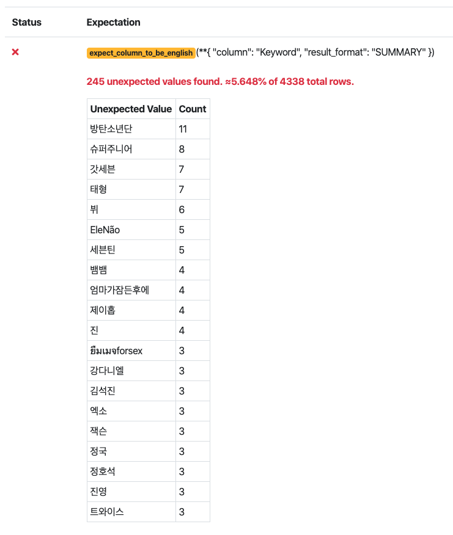
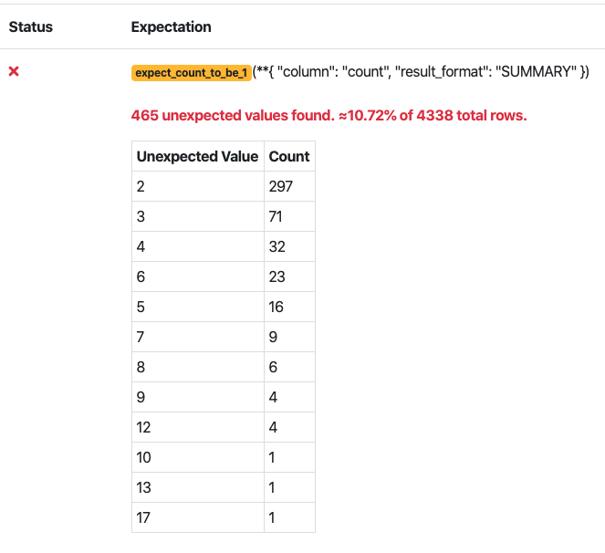

# Overview

### Here are the list of things that Great Expectations can do, according to their Introduction page.
* Save time during data cleaning and munging.
* Accelerate ETL and data normalization.
* Streamline analyst-to-engineer handoffs.
* Streamline knowledge capture and requirements gathering from subject-matter experts.
* Monitor data quality in production data pipelines and data products.
* Automate verification of new data deliveries from vendors and other teams.
* Simplify debugging data pipelines if (when) they break.
* Codify assumptions used to build models when sharing with other teams or analysts.
    - this would be very very helpful
* Develop rich, shared data documention in the course of normal work.
    - is this something that is automatically generated?
* Make implicit knowledge explicit.

### Key Features and Terms

An Expectation is something that is conceptually similar to assertions in Unittesting. Great Expectations currently supports native execution of Expectations in three environments: pandas, SQL (through the SQLAlchemy core), and Spark. This approach follows the philosophy of “take the compute to the data" (this may be where I can have the easiest contribution... implementing something that is already there in another language or context)

DataContext and DataSource
Writing pipeline tests from scratch can be tedious and counterintuitive. Great Expectations jump starts the process by providing powerful tools for automated data profiling. This provides the double benefit of helping you explore data faster, and capturing knowledge for future documentation and testing.

### Bringing in Data from Twitter
The data that I am using is from my Insight project #OldNews, which batch processed Twitter data to identify hashtags that were decreasing in their popularity.  The initial processing was done using Spark on an Amazon EC2 cluster, but for the case of this demo, I'll be using a local instance of Pyspark to process one small batch of tweets 10-01-2018

After processing using the 'ETL_to_CSV.ipynb' notebook, the data looks like this and is ready for processing. For the sake of this tutorial, I've stored the same data as a csv in the /data folder.
```SHELL
+----------------+---------------+-----+
|         Keyword|           Time|count|
+----------------+---------------+-----+
|           Wendy|2018-10-1 19:00|    1|
|GrowingUpSwedish| 2018-10-2 4:00|    1|
|  IVYSONTOUR2018|2018-10-1 16:00|    1|
|    mylittlepony|2018-10-1 13:00|    1|
|          JBAUSA|2018-10-1 17:00|    1|
|             Now|2018-10-1 22:00|    1|
|         LULLABY|2018-10-1 18:00|    1|
|   growthhacking|2018-10-1 23:00|    1|
|   TheMusicVideo|2018-10-1 23:00|    1|
|             EXO|2018-10-1 20:00|    1|
+----------------+---------------+-----+
```

Using GreatExpectations, I'm trying to do 2 very simple checks. First, are all of my keywords in English (I've already filtered for language 'en' in the tweets, but I'm not sure if it's working perfectly). Second, I also want to know how many tweets per batch have greater than 1 occurance. This would give me a better idea as to how much 'new' information I am adding to my database each day. 

### Creating an Expectation Suite
I first created a new empty expectation suite, and named it 'IsMyKeyWordEnglish_Custom'
```SHELL
    great_expectations suite new --empty
```
### Customizing the Expectation Itself 
Creating a custom expecation first requires making a custom module in the ```\great_expectations\plugins\modules``` directory and modifying the great_expectations.yml file to make sure the suite knows about it.

First here is how the datasources section changed for the ```great_expectations.yml``` file.

```YML
datasources:
  files_datasource:
    module_name:
    data_asset_type:
      module_name:
      class_name: PandasDataset
    class_name: PandasDatasource
  tweets:
    class_name: PandasDatasource
    data_asset_type:
      class_name: CustomPandasDataset
      module_name: custom_module.custom_dataset
```

You'll notice there is a new datasource called ```tweets```. It is a PandasDatasource, since that is how I am processing the file, and the data_asset_type is associated with a CustomPandasDataset with a module. The module name is set as ```custom_module.custom_dataset``` which is where my code lives in the ```\great_expectations\plugins\modules``` folder.

Next is the code that actually lives in the ```custom_module.custom_dataset``` module. The Expectation to check whether or not the Keyword field is english is a simple conversion. The program attempts to encode the string into utf-8 and decode in ascii. If it fails then it is not an english hashtag. It will miss things like emojis, and a more 'sophisticated' version may be added in a later version. You'll notice that, as per the GreatExpectations documentation, I've created a CustomPandasDatset class that extends PandasDataset object.  It also had the ```@MetaPandasDataset.column_map_expectation``` decorator for each of the functions, and then returns a ```True``` or ```False``` value depending on whether or not the Expectation is met. 

```PYTHON
from great_expectations.dataset import PandasDataset, MetaPandasDataset


# -*- coding: utf-8 -*-
def isEnglish(s):
    try:
        s.encode(encoding='utf-8').decode('ascii')
    except UnicodeDecodeError:
        return False
    else:
        return True
        

class CustomPandasDataset(PandasDataset):

    _data_asset_type = "CustomPandasDataset"

    @MetaPandasDataset.column_map_expectation
    def expect_column_to_be_english(self, column):
        return column.map(isEnglish)
        
    @MetaPandasDataset.column_map_expectation
    def expect_count_to_be_1(self, column):
        return column.map(lambda x: x==1)
```

### Results
The results of this code are the following two images from ```validation_playground.ipynb``` Notebook in the ```notebooks/pandas``` folder. 


We see that around 5% of total processed hashtags are non-English, which actually isn't as bad as I thought. 



We also observe that around 90% of total hashtags for each day are unique, which means we may need to sample more of the total dataset, or increase the throughput of the pipeline. 

## Next Steps and Remaining Questions
* Add some sort of test with a relational database to get my feet wet. 
* Is there any feature that can incorporate stream data? How would the structure of the code have to change in order for this to happen?